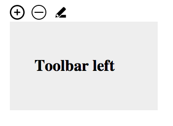

# Toolbar

Flyout toolbar



## Usage

Adds a toolbar with icons on hover over an dom element.

```
toolbar(el, {
    height: 30,
    position: pos,
    icons: {

		// will trigger custom dom event when icons get clicked
        "../resources/add.svg":     "add", 
        "../resources/remove.svg":  "remove",
        "../resources/edit.svg":    function () {
            console.log('edit');
        }
    }
});
```


### Example icons

```
add:        Kevin Kwok,   from The Noun Project
remove:     John Chapman, from The Noun Project
edit:       Cuatrocronos, from The Noun Project
```
